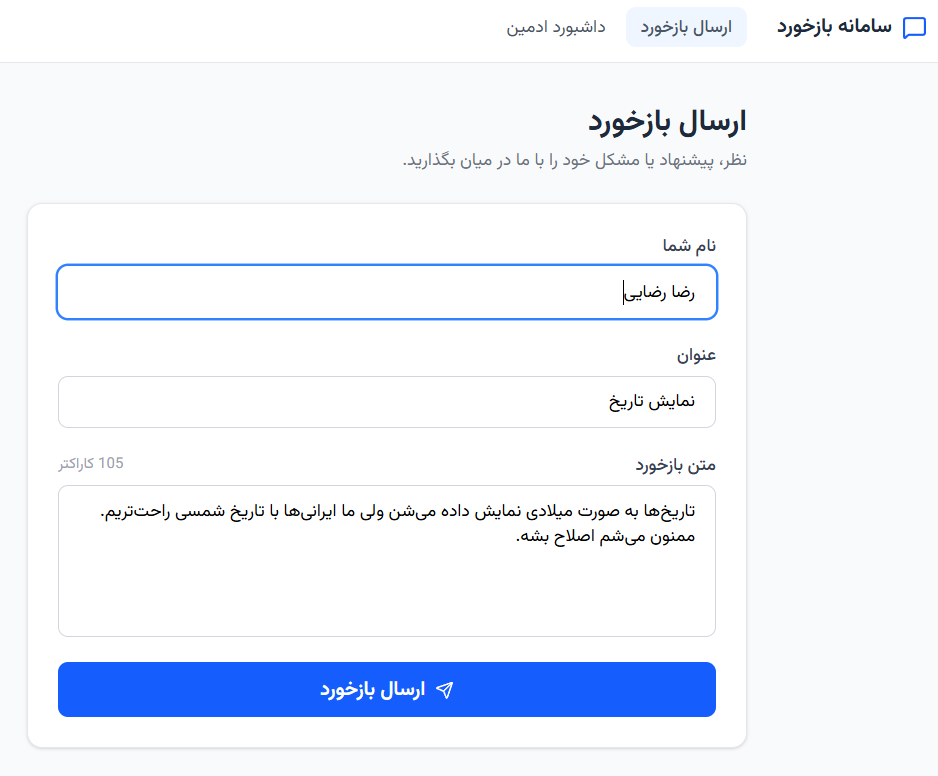
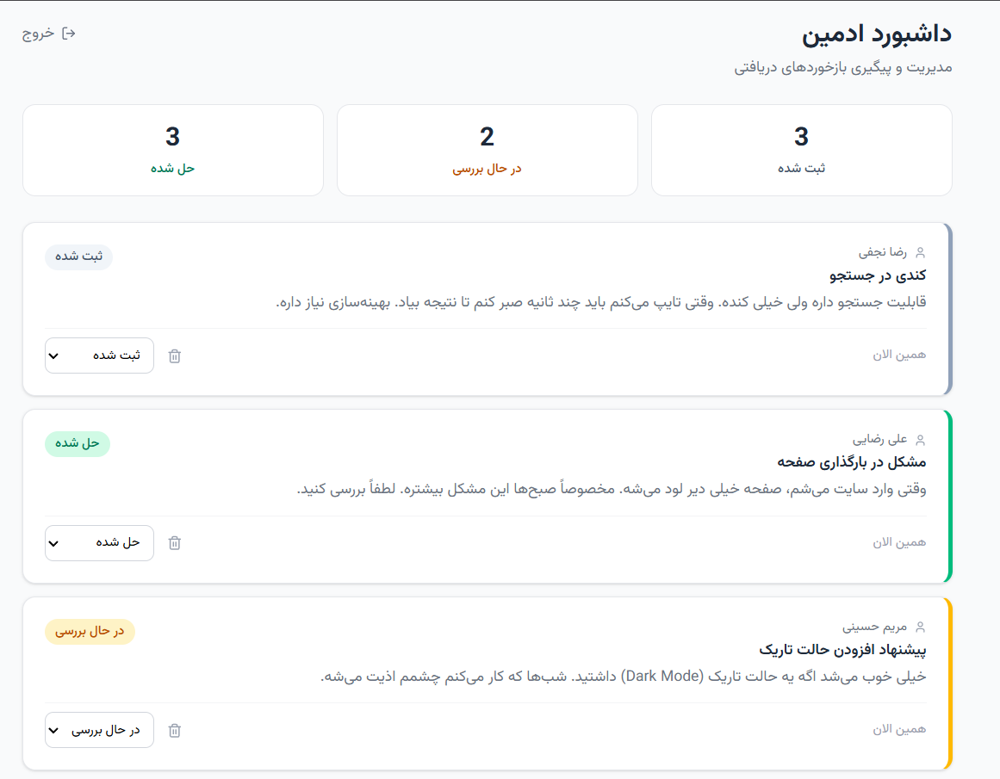
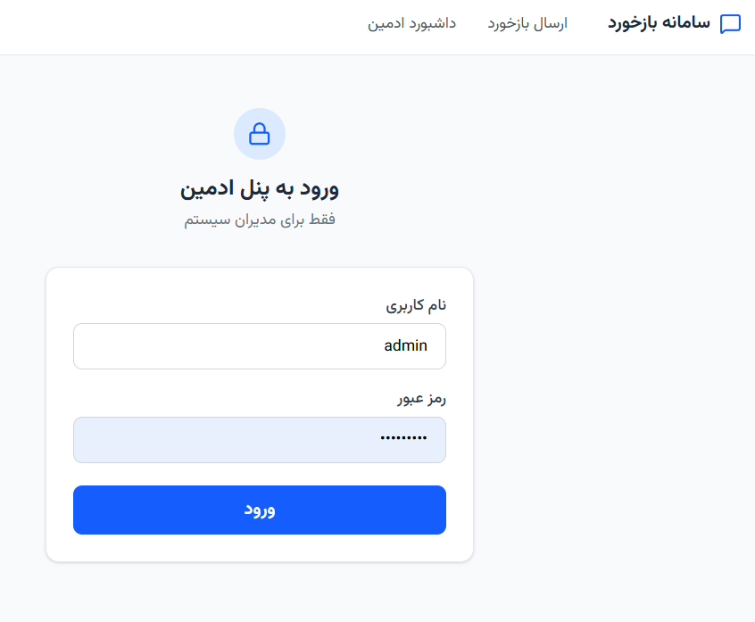

# سیستم مدیریت بازخورد — Feedback Management System

A Persian-language feedback management system built with TanStack Start, Drizzle ORM, and PostgreSQL. Users can submit feedback; admins can track and update its status through a protected dashboard.

---

## Screenshots

### Feedback Submission Page


### Admin Dashboard


### Login Page


---

## Running Locally

### Prerequisites

- [Bun](https://bun.sh) (or Node.js 20+)
- PostgreSQL running locally

### 1. Clone and install

```bash
git clone <repo-url>
cd with-hello
bun install
```

### 2. Configure environment

Create a `.env.local` file in the project root:

```env
DATABASE_URL=postgresql://<user>:<password>@localhost:5432/<dbname>
ADMIN_USERNAME=admin
ADMIN_PASSWORD=your-secure-password
SESSION_SECRET=a-long-random-string-at-least-32-chars
```

### 3. Set up the database

```bash
bun run db:push
```

### 4. Start the dev server

```bash
bun run dev
```

Open [http://localhost:3000](http://localhost:3000).

| URL | Description |
|-----|-------------|
| `/` | User feedback submission form |
| `/admin` | Admin dashboard (requires login) |
| `/login` | Admin login page |

---

## Technical Decisions

### Framework — TanStack Start
Chosen for its file-based routing, first-class SSR, and `createServerFn` — a typed RPC primitive that lets you define server-side logic directly alongside the component that uses it, with no separate API layer or REST endpoints. This eliminated boilerplate while keeping the server/client boundary explicit and fully type-safe end-to-end.

### Database — Drizzle ORM + PostgreSQL
Drizzle's query builder reads close to raw SQL, so the intent is always clear. Schema changes during development are a single `bun run db:push`. TypeScript types are inferred directly from the schema, so there's no code generation step and no runtime type mismatch risk.

### Auth — HMAC-SHA256 tokens, no external library
Admin auth uses a signed token stored in an `httpOnly` cookie. The payload encodes an expiry timestamp; the signature is HMAC-SHA256 over that payload using a secret from the environment. Verification uses `crypto.timingSafeEqual` to prevent timing attacks. No JWT library, no session store — just Node's built-in `node:crypto`. The session is valid for 7 days.

### Styling — Tailwind CSS v4 with full RTL
The UI is fully right-to-left Persian. `lang="fa" dir="rtl"` is set on `<html>`, and Tailwind's logical properties (`border-s-4`, `ms-auto`, etc.) handle directional layout without custom overrides. The Persian font Vazirmatn is loaded from Google Fonts.

### Scope
One database table, three server functions per concern, no state management library. The entire application is under 10 files of code — deliberately kept simple per the project requirements.
